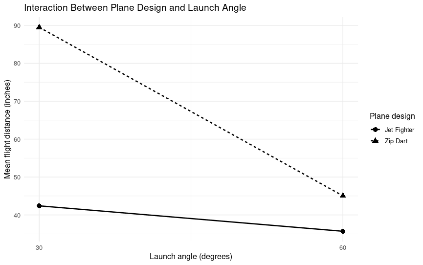
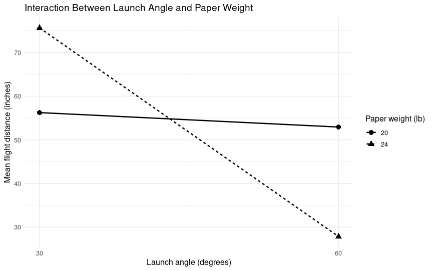
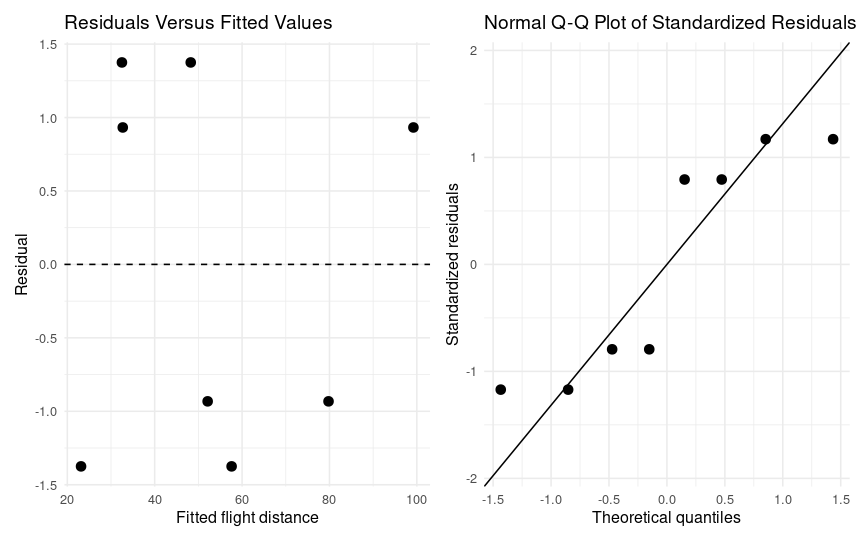

# Paper Airplane Factorial Design

Factorial experimental design study of paper airplane flight performance, including experimental redesign, interaction analysis, model diagnostics, and curvature assessment.

## Project Overview

This project investigated how three factors affected paper airplane flight distance:

- plane design
- paper weight
- launch angle

The study began with an outdoor factorial experiment using two plane designs, two paper weights, and two launch angles. The initial results showed substantial variation among repeated launches, making it difficult to separate treatment effects from uncontrolled environmental variation.

The experiment was then redesigned and repeated indoors with improved environmental control and a wider separation between launch angle settings.

The redesigned experiment reduced average within treatment variability by approximately 80 percent.

## Experimental Design

The redesigned experiment used a full \(2^3\) factorial design with:

- **Plane design:** Zip Dart and Jet Fighter
- **Paper weight:** 20 lb and 24 lb
- **Launch angle:** 30° and 60°
- **Response:** mean flight distance in inches

Three launches were performed for each treatment combination.

Additional runs were later performed at a 45° launch angle to assess whether a quadratic angle effect was needed.

## Factorial Analysis

The largest estimated effects were:

- plane design
- launch angle
- design × angle
- angle × paper weight

The half normal effect plot showed a clear separation between these larger effects and the remaining smaller effects.

Because the model included important interactions, interpretation focused on the combined behavior of the factors rather than on main effects alone.

## Key Interactions

### Plane Design × Launch Angle

The Zip Dart had a substantial advantage over the Jet Fighter at 30°, but the difference between designs was much smaller at 60°.



### Launch Angle × Paper Weight

Paper weight had little effect at 60° in the same direction as it did at 30°. The 24 lb paper performed particularly well at the lower launch angle but showed a large decrease in mean distance at 60°.



## Experimental Redesign

The original outdoor experiment exhibited high variation among repeated launches.

Mean within treatment standard deviation decreased from approximately **35.45 inches** in the initial experiment to **7.12 inches** after the redesign.

Mean within treatment range decreased from approximately **68.21 inches** to **13.65 inches**.

Both measures decreased by about **80 percent**, showing that the redesigned experimental procedure produced substantially more consistent measurements.

## Model Diagnostics

A reduced factorial model retained the three main effects together with the design × angle and angle × paper interactions.

Residual plots did not show obvious model problems, although diagnostic power was limited by the small number of factorial treatment combinations.



## Curvature Assessment

Additional runs at a 45° launch angle were used to assess curvature.

The quadratic angle term was not statistically significant (\(p = 0.132\)), so the data did not provide strong evidence that a second order angle term was needed over the tested range.

## Practical Findings

The best observed treatment combination in the redesigned factorial experiment was:

- **Zip Dart**
- **24 lb paper**
- **30° launch angle**

This combination produced a mean flight distance of approximately **100.1 inches**.

The interaction results also suggested that lower launch angles were more favorable for the Zip Dart and for heavier paper, making lower angle settings a reasonable direction for future experimentation.

## Repository Structure

```text
paper-airplane-factorial-design/
│
├── README.md
├── data/
│   ├── initial_experiment.csv
│   └── redesigned_experiment.csv
├── analysis/
│   └── factorial_analysis.R
└── figures/
    ├── effect_screening.png
    ├── design_angle_interaction.png
    ├── angle_paper_interaction.png
    └── residual_diagnostics.png
